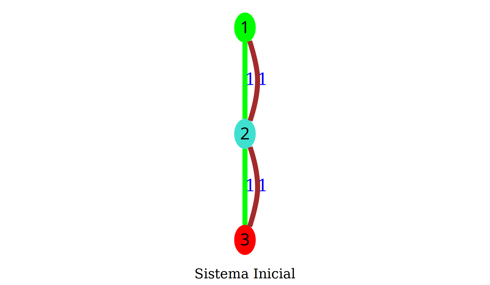
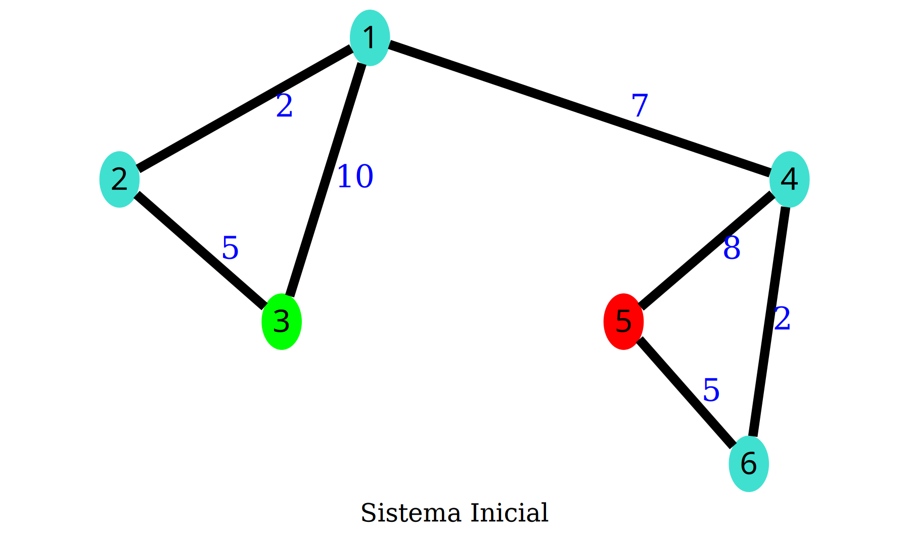
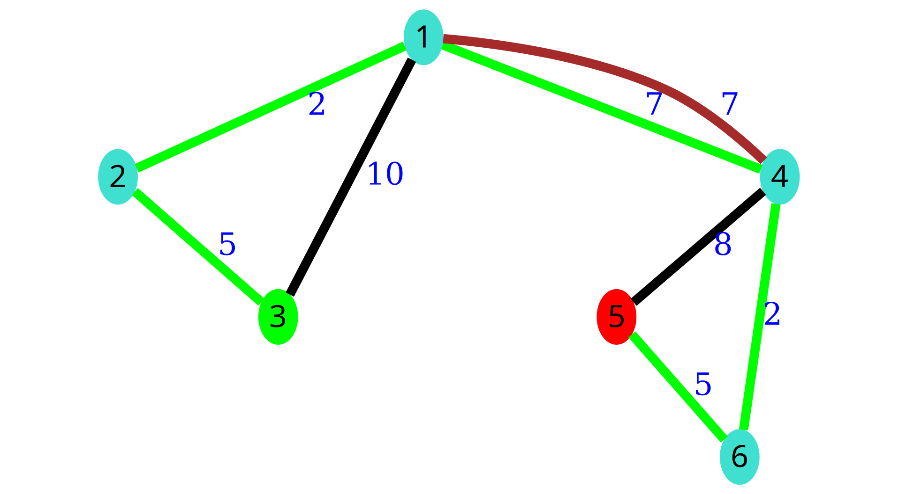

# Preservando o Cerrado (Maratona UnB)

**Número da Lista**: 3<br>
**Conteúdo da Disciplina**: Algoritmos ambiciosos<br>

## Alunos
|Matrícula | Aluno |
| -- | -- |
| 15/0129815 | Ícaro Pires de Souza Aragão |
| 16/0144752 | Sara Conceição de S. A. Silva |

## Sobre 
Solução da questão da Maratona UnB de programação com visualização associada. Link para questão [aqui](https://codeforces.com/group/btcK4I5D5f/contest/253645/problem/B). [Link da submissão](https://codeforces.com/group/btcK4I5D5f/contest/253645/submission/62655005).

## Visualização

O nó verde é o início do percurso e o vermelho é o fim do percurso. As arestas verdes indicam o menor caminho escolhido e as arestas marrons indicam os canos auxiliares aos canos críticos.

### Input Pequeno

#### Input


#### Solução



### Input Grande

#### Input



#### Solução



## Instalação 

**Linguagem**: Python 3.7

Instale o pacote graphviz da sua distribuição. Ex:

``` sh
# No Fedora
sudo dnf install graphviz

# Ou no Arch
sudo pacman -S graphviz
```

e instale as dependências do python com:

``` sh
# Ou apenas pip ao invés de pip3 no Arch
# É melhor instalar na virtualenv ao invés de no usuário
pip3 install -r requirements.txt --user
```

## Uso 

Após a instalação das dependências basta executar o seguinte comando:

``` sh
python3 solution.py
```

e seguir as intruções exibidas para gerar seu problema e sua solução.
